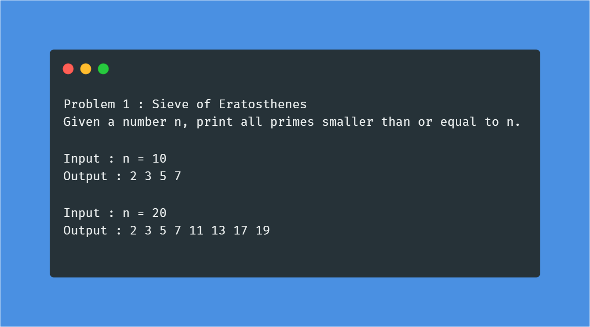
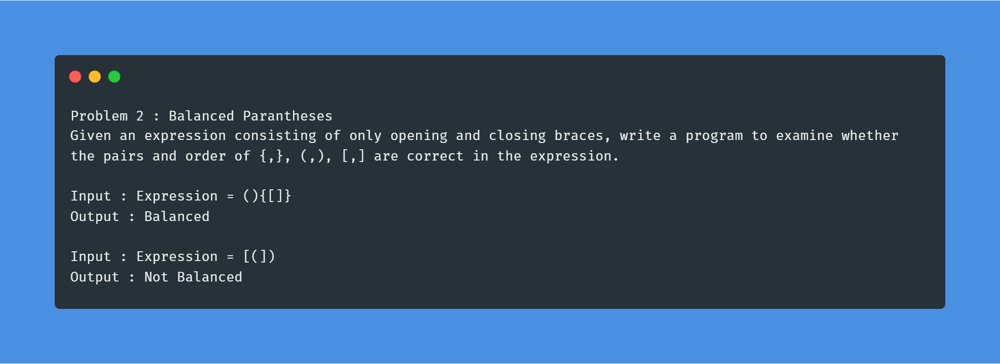
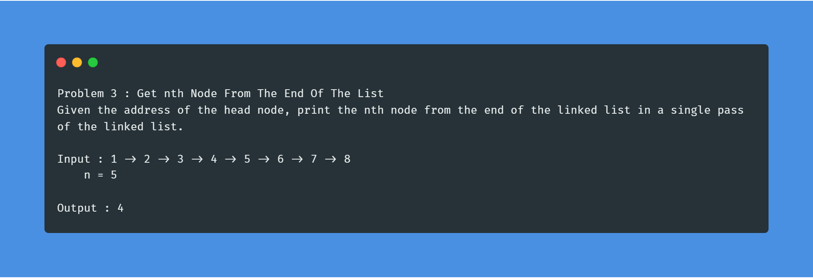
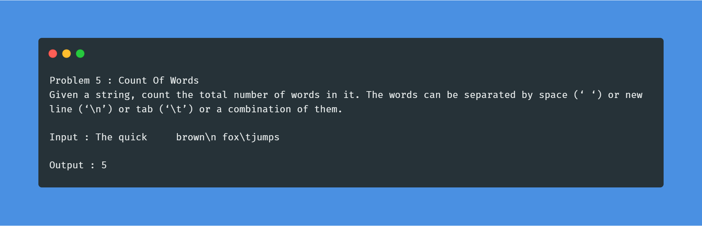
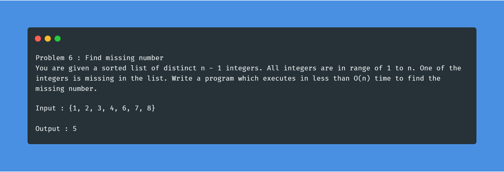
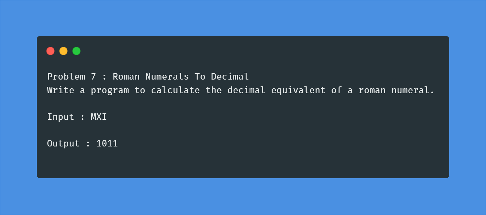
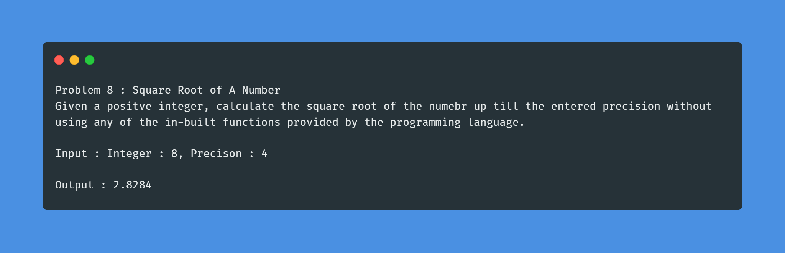
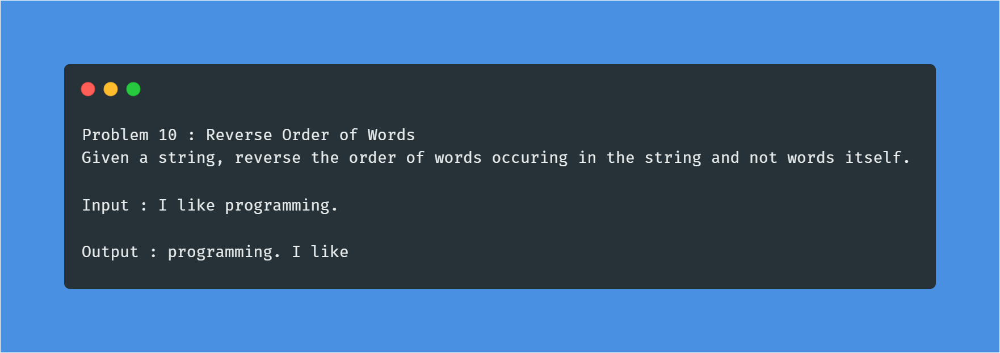

# AlgorithmsDaily
#### What is this?
This is a repository created for contribution to HacktoberFest 2019. All you need to do is implement solutions to the below questions and send in a pull request, so that you can stand a chance to win a limited edition HacktoberFest T-Shirt. Make sure you register [here](https://hacktoberfest.digitalocean.com/) before you start sending in pull requests. For more details, check out the FAQ's section. 

**Plagiarsm is highly discouraged and will be viewed seriously.**

### Problem 1
<div align="left">
  </img>
</div>

### Problem 2
<div align="left">
  </img>
</div>

### Problem 3
<div align="left">
  </img>
</div>

### Problem 4
<div align="left">
  </img>
</div>

### Problem 5
<div align="left">
  </img>
</div>

### Problem 6
<div align="left">
  </img>
</div>

### Problem 7
<div align="left">
  </img>
</div>

### Problem 8
<div align="left">
  </img>
</div>

### Problem 9
<div align="left">
  </img>
</div>

### Problem 10
<div align="left">
  </img>
</div>

## FAQ'S
#### Who can contribute to this repo?
  Anybody who is passionate about Open Source and can contribute quality solutions to the aforementioned questions in any programming language.

#### When should I submit pull request(s)?
  You can submit pull request(s) anytime from October 1, 2019 to October 31, 2019. If your pull request(s) meet a certain threshold quality, they will be merged, else shall be marked as spam.
  Here is an excellent [repo](https://www.digitalocean.com/community/tutorials/how-to-create-a-pull-request-on-github) explaining how to make your first pull request.
  
  **Send a pull request only after you complete at least one problem.**

  #### What language should I use to code?
  All programming languages are more than just welcomed here.

  #### I have never used to Git or GitHub. What should I do?
  No worries! It's never too late to start learning. Check out this excellent [course](https://www.udacity.com/course/version-control-with-git--ud123) on Udacity to learn about Git and GitHub.

  #### How should I submit solutions?
  We have maintained a folder for each problem. Make sure your file format is as follows:-
 ```bash
 Name : <insert your name>
 College : <insert College Name>
 Year/Branch : <insert year/insert branch>
 Email Id : <insert your E-mail Id>

 /*insert your code here*/

 ```

Name your file as `Language_Username` and place it in the appropriate folder.

 #### I forked the repository but some questions were added only after that. How do I access those?
  Open Git Bash or your Command Prompt and navigate over to your forked repository. Enter the following commands:
  ```bash
  git remote add origin https://github.com/SVCE-HacktoberFest2019/AlgorithmsDaily.git
  git fetch origin
  git merge origin/master
  ```
  #### What do I do if I see a merge conflict?
This does not happen until you modify an existing file in the repository. The easiest thing to do is to make a copy of your code outside the repository and then clone it once again. Merge it to the `master` branch, add your code and continue contributing :).

  #### I believe there is a mistake/error in one or more of the questions.
  Open an [issue](https://github.com/SVCE-HacktoberFest2019/AlgorithmsDaily/issues) on the bug tracker and we will get back to you.
  
  #### What should I do after contributing?
  Check [here](https://hacktoberfest.digitalocean.com/profile) if your pull requests are being counted towards your progress.
  
  If you did enjoy solving the problems, please do give us a star so that we can reach out to more people.
